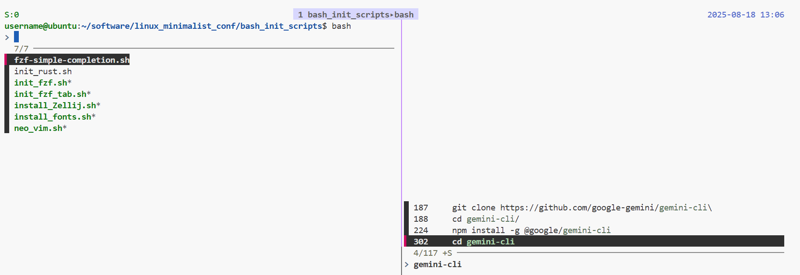

# Linux Minimalist Configuration

A lightweight and efficient configuration setup for Bash and tmux on Linux systems, providing enhanced user experience while maintaining full compatibility.



## Features

- **Enhanced Bash**: FZF Integration, improved history management, colored prompts, and useful aliases 
  - **Quick history**: `Ctrl +R` for history search
  - **Tab completion**: `Tab` completion for file paths
- **Enhanced Tmux**: Modern tmux light Theme
  - **History recovery**: Inside tmux, press the Tmux prefix `ctrl+b` , then 
    - `Ctrl + S` for saving tmux session.
    - `Ctrl + R` for restoring tmux session.
  - **Minimal Mouse Support**: 
    - Mouse Click to easily switch between panes
    - Mouse Scroll for scrolling through terminal output
    - Mouse Support for resizing panes
- **Installer**: 
  - **Terminal Fonts**: Nerd Fonts support for better visual experience
  - **Tools**: Automated installation scripts for various tools

## Prerequisites

- Linux system (tested on Ubuntu/Debian-based distributions)
- Git
- Bash shell
- curl/wget for downloading packages
- Basic development tools (gcc, make) for some optional components

## Quick Start

1. Clone the repository:
```bash
git clone https://github.com/YiyangLu/linux_minimalist_conf.git
cd linux_minimalist_conf
```

2. Copy configuration files to your home directory:
```bash
mv ~/.bashrc ~/.bashrc_backup
mv ~/.tmux.conf ~/.tmux.conf_backup
cp .bashrc ~/
cp .tmux.conf ~/
```

3. Source the new bash configuration:
```bash
bash bash_init_scripts/init_fzf.sh # install FZF (Recommended)
source ~/.bashrc
```

4. Installing tmux Plugins

First, install TPM (Tmux Plugin Manager):
```bash
git clone https://github.com/tmux-plugins/tpm ~/.tmux/plugins/tpm
```

Then, inside tmux, press `prefix + I` (default prefix is `Ctrl+b`) to install plugins.
## Installation Scripts

### FZF (Fuzzy Finder)

Install FZF for enhanced command-line fuzzy finding:
```bash
bash bash_init_scripts/init_fzf.sh
```

To upgrade FZF later:
```bash
cd ~/.fzf && git pull && ./install
```

### Advanced FZF Tab Completion [Optional]

Disable Default (FZF SIMPLE COMPLETION) Tab Completion, comment the following line in `.bashrc_conf`:

```bash
. ~/software/linux_minimalist_conf/bash_init_scripts/fzf-simple-completion.sh
```

Install Advanced tab completion:
```bash
bash bash_init_scripts/init_fzf_tab.sh
```

Add to `.bashrc_conf`:
```bash
source ~/software/fzf-tab-completion/bash/fzf-bash-completion.sh
bind -x '"\t": fzf_bash_completion'
```

### Nerd Fonts [Optional]

Install Cascadia Code Nerd Font for better terminal icons:
```bash
bash bash_init_scripts/install_fonts.sh
```

### Neovim [Optional]
Install the latest Neovim:
```bash
bash bash_init_scripts/neo_vim.sh
```

### Rust [Optional]

Install Rust programming language and Cargo:
```bash
bash bash_init_scripts/init_rust.sh
```

### Zellij Terminal Multiplexer [Optional]

Install Zellij (alternative to tmux):
```bash
bash bash_init_scripts/install_Zellij.sh
```

## Configuration Details

### Bash Configuration

The `.bashrc` sources `.bashrc_conf` which provides:
- Smart history management (no duplicates, persistent across sessions)
- Colored command prompt with username, hostname, and working directory
- Useful aliases:
  - `ll` - detailed list with all files
  - `la` - list all except . and ..
  - `l` - compact list format
  - Colored output for `ls`, `grep`, `fgrep`, `egrep`
- Window title updates for terminal emulators
- Bash completion support

### tmux Configuration

The `.tmux.conf` includes:
- **Minimal Modern Light Theme**: Clean, distraction-free interface
- **Status Bar**: 
  - Top position with centered window list
  - Session name on the left
  - Date/time on the right
  - Visual indicator for prefix key activation
- **Plugins** (via TPM):
  - tmux-sensible: Enable basic options
  - tmux-resurrect: Save and restore tmux sessions
  - tmux-continuum: Automatic session saving
- **1000 lines scrollback buffer**

## Directory Structure

```
linux_minimalist_conf/
├── .bashrc                 # Main bash configuration entry point
├── .bashrc_conf           # Detailed bash settings and aliases
├── .tmux.conf             # tmux configuration with custom theme
├── bash_init_scripts/     # Installation and initialization scripts
│   ├── init_fzf.sh       # FZF installer
│   ├── init_fzf_tab.sh   # FZF tab completion setup
│   ├── fzf-simple-completion.sh  # Simple FZF completion
│   ├── init_rust.sh      # Rust installer
│   ├── install_fonts.sh  # Nerd Fonts installer
│   ├── install_Zellij.sh # Zellij terminal multiplexer installer
│   └── neo_vim.sh        # Neovim installer
└── doc/
    └── example.png        # tmux screenshot example
```

## Customization

### Changing tmux Theme Colors

Edit `.tmux.conf` to modify the color scheme. Key color codes:
- `colour135`: Purple (main accent)
- `colour189`: Light purple (active window background)
- `colour46`: Green (prefix key indicator)
- `colour69`: Blue (date/time)

## License

This project is open source and available for anyone to use and modify.